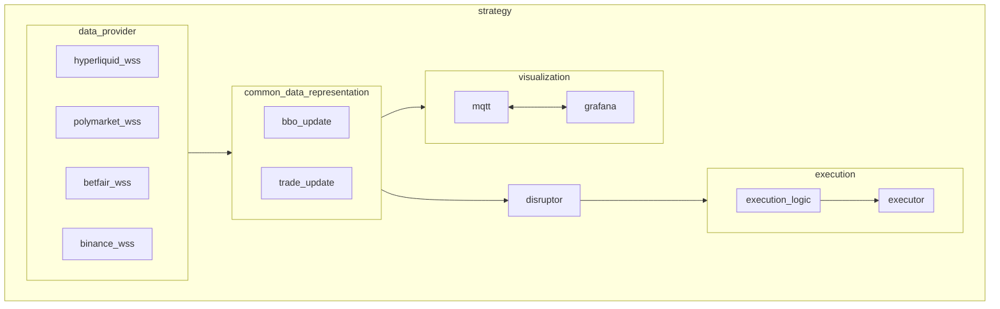
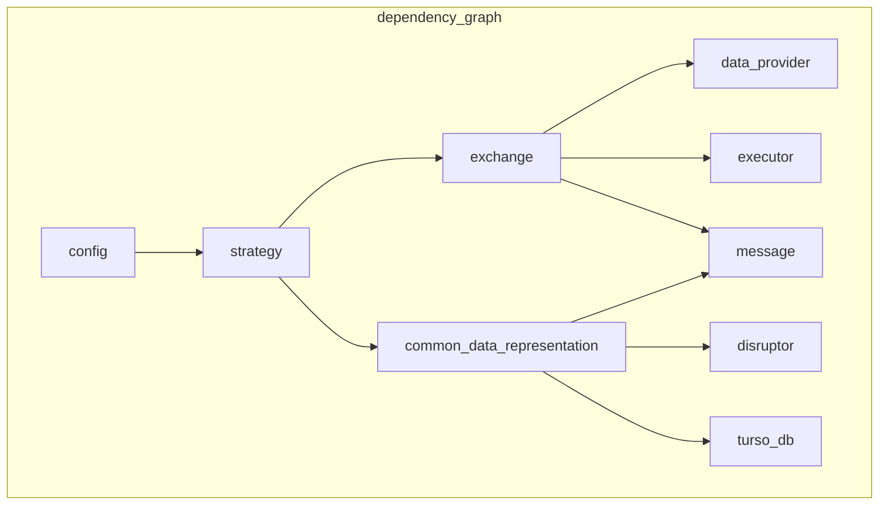

# sbOogway's market making arbitrage

## about
framework for market making and arbitrage on various exchanges and assets

## architecture

## dependency graph

> [!tip]
> use `cargo test` to verify that there are no circular dependencies