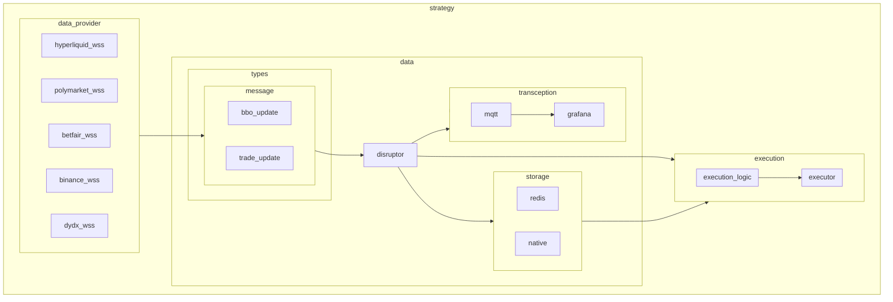
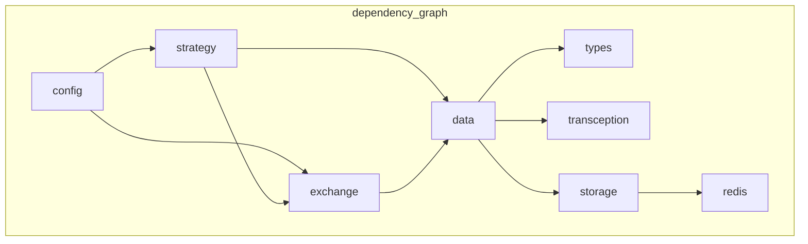
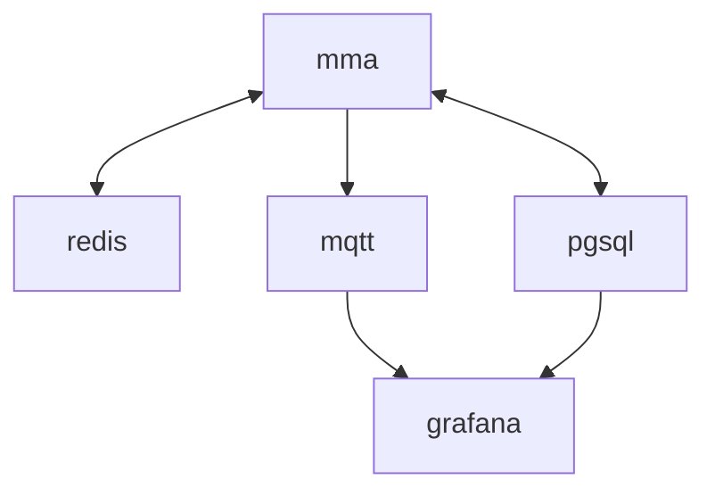
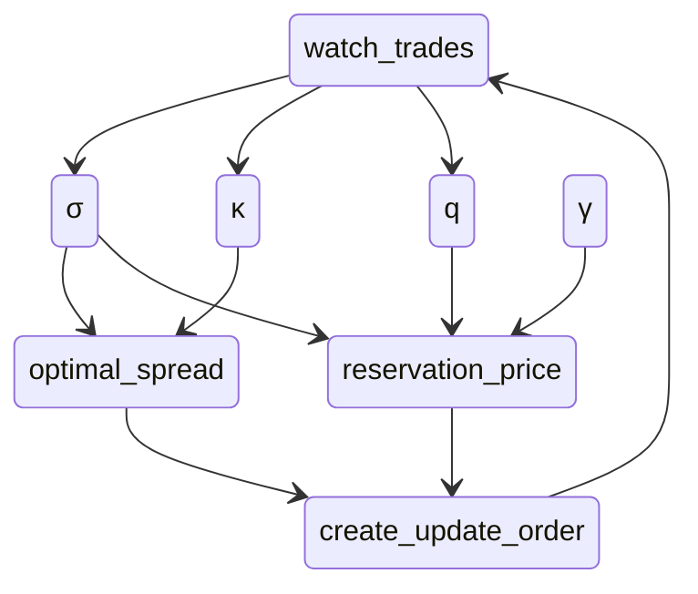

# sbOogway's market making arbitrage

## about
framework for market making and arbitrage on various exchanges and assets

## docs
https://docs.rs/mma/latest/mma/index.html

## architecture
### data flow

### dependency graph

> [!tip]
> use `cargo test` to verify that there are no circular dependencies

### services

### strategies
#### avellaneda stoikov market making
